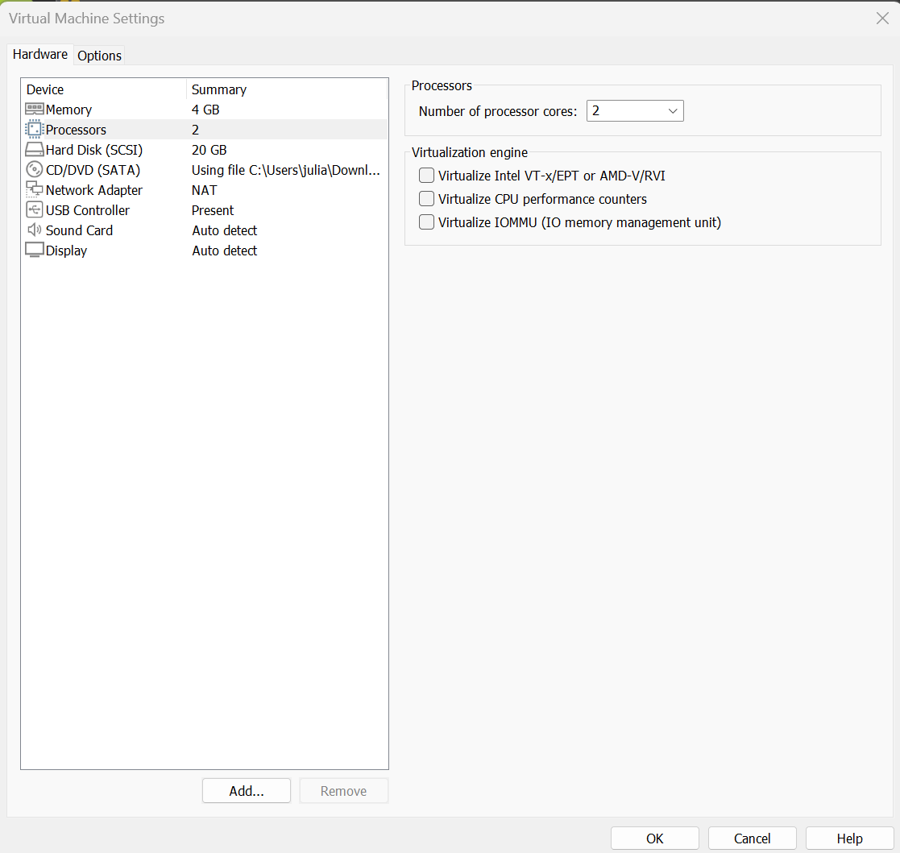
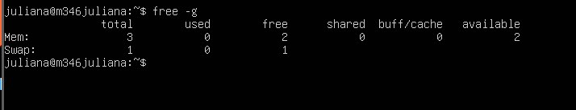

# KN01 Abgabe

## Screenshot mit der Konsolen-Ausgabe der CPUs bei weniger CPU als Ihr Host-System hat.

## Screenshot mit der Konsolen-Ausgabe der CPUs (oder Fehlermeldung des Host-Systems) bei mehr CPU als Ihr Host-System hat.

## Screenshot mit der Konsolen-Ausgabe des RAM bei weniger RAM als Ihr Host-System hat.

 
## Screenshot mit der Konsolen-Ausgabe der RAM (oder Fehlermeldung des Host-Systems) bei mehr RAM als Ihr Host-System hat.

## Erklärung wieso Sie Fehlermeldungen kriegen oder Erklärung wie es möglich ist, dass Sie mehr Ressourcen zuteilen können als Ihr Host-System hat. Machen Sie sinnvolle Überlegungen

Wenn man Fehlermeldungen bekommt, hat das Host-System nicht genug Ressourcen, um die zugewiesenen Werte zu erfüllen. 
Manchmal kann man in virtuellen Umgebungen mehr Ressourcen zuweisen, als tatsächlich verfügbar sind. Dabei versucht das System, mit nicht vorhandenen Ressourcen zu arbeiten, was zu schlechterer Leistung oder Instabilität führen kann.
