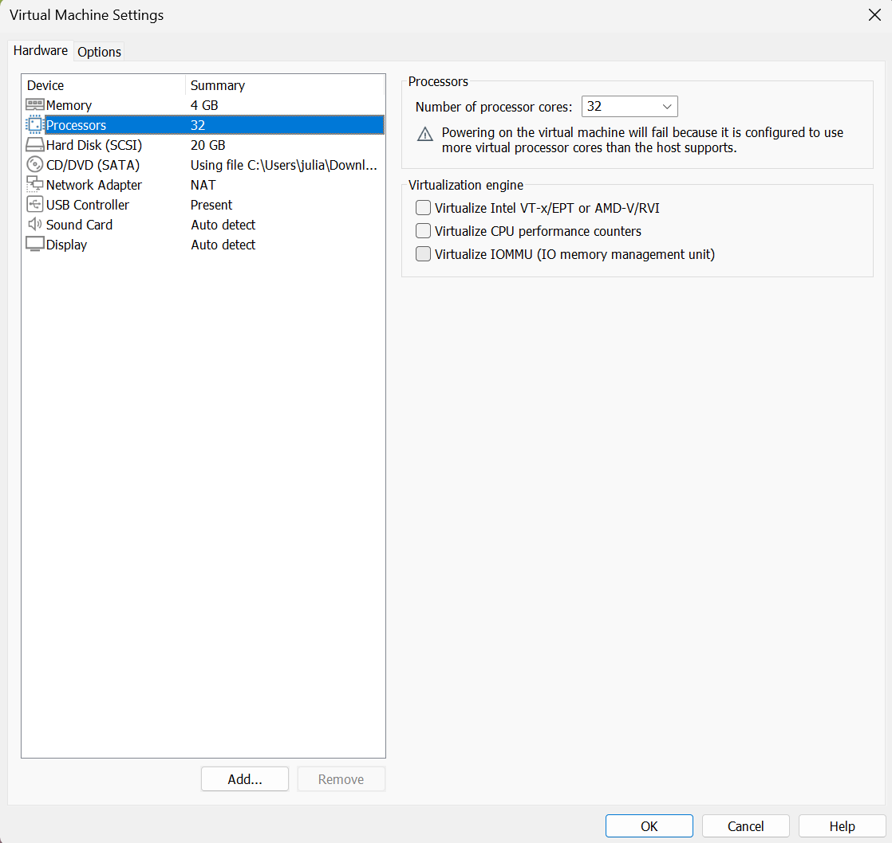
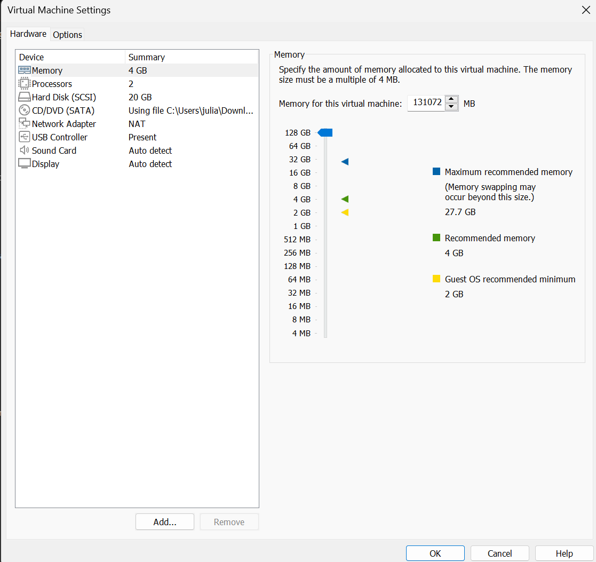
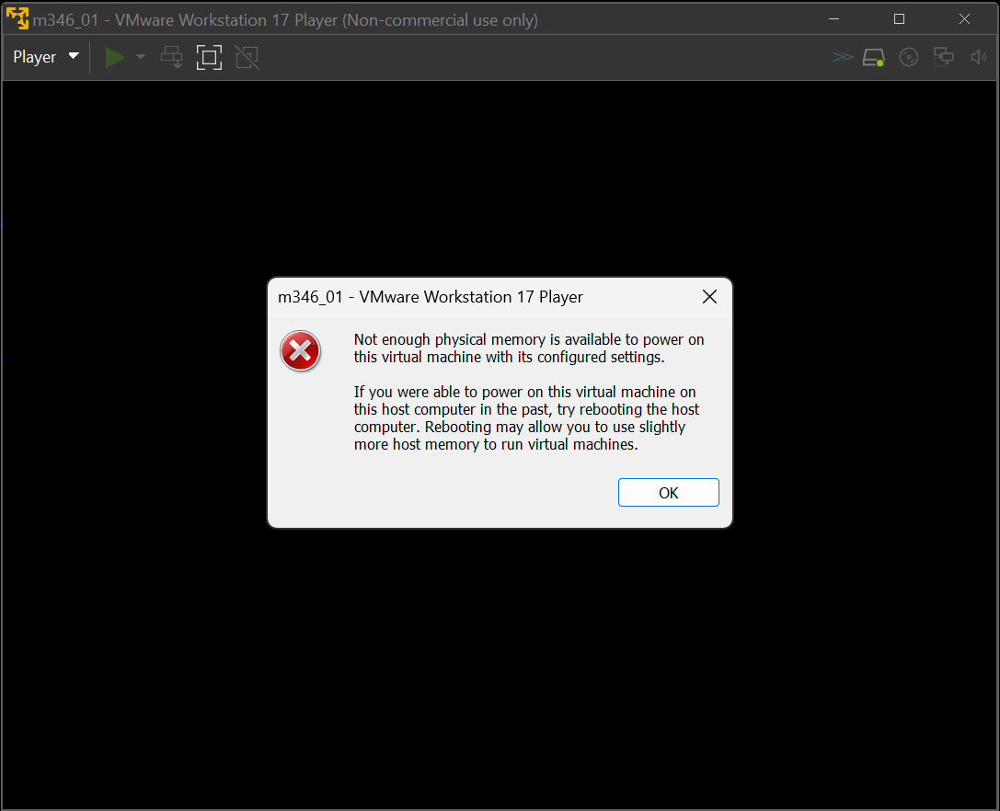

# KN01 Abgabe

Screenshot mit der Konsolen-Ausgabe der CPUs bei weniger CPU als Ihr Host-System hat.

Screenshot mit der Konsolen-Ausgabe der CPUs (oder Fehlermeldung des Host-Systems) bei 
mehr CPU als Ihr Host-System hat.

Screenshot mit der Konsolen-Ausgabe des RAM bei weniger RAM als Ihr Host-System hat.
 
Screenshot mit der Konsolen-Ausgabe der RAM (oder Fehlermeldung des Host-Systems) bei 
mehr RAM als Ihr Host-System hat.

Erklärung wieso Sie Fehlermeldungen kriegen oder Erklärung wie es möglich ist, dass Sie 
mehr Ressourcen zuteilen können als Ihr Host-System hat. Machen Sie sinnvolle 
Überlegungen
